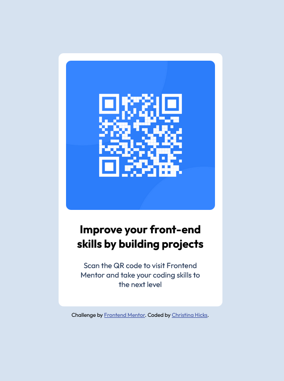

# Frontend Mentor - QR code component solution

This is a solution to the [QR code component challenge on Frontend Mentor](https://www.frontendmentor.io/challenges/qr-code-component-iux_sIO_H). Frontend Mentor challenges help you improve your coding skills by building realistic projects.

## Table of contents

- [Overview](#overview)
  - [Screenshot](#screenshot)
  - [Links](#links)
- [My process](#my-process)
  - [Built with](#built-with)
  - [What I learned](#what-i-learned)
  - [Continued development](#continued-development)
  - [Useful resources](#useful-resources)
- [Author](#author)

## Overview

### Screenshot

### Links

- [Solution URL](https://github.com/PTN6389/qr-code-component)
- [Live Site URL](https://ptn6389.github.io/qr-code-component/)

## My process

### Built with

- Semantic HTML5 markup
- CSS custom properties
- Flexbox

### What I learned

I've learned a little bit more about the difference between Flexbox and Grid display. I chose Flexbox for this challenge because it's a simple layout. I initially did not have the flex-direction set, but my footer was displaying in the same row as my main content, so I had to add the flex-direction: column, which fixed the issue.

### Continued development

I will continue to work on how to use CSS to display the layout of a page using Flexbox and Grid.

### Useful resources

I used ChatGPT to help me understand the concepts of centering the main content, and the differences between Flexbox and Grid.

## Author

- Portfolio Website - [Christina Hicks](https://ptn6389.github.io/portfolio-website/)
- LinkedIn - [LinkedIn](https://www.linkedin.com/in/christinahicks1)
- Frontend Mentor - [@PTN6389](https://www.frontendmentor.io/profile/PTN6389)
